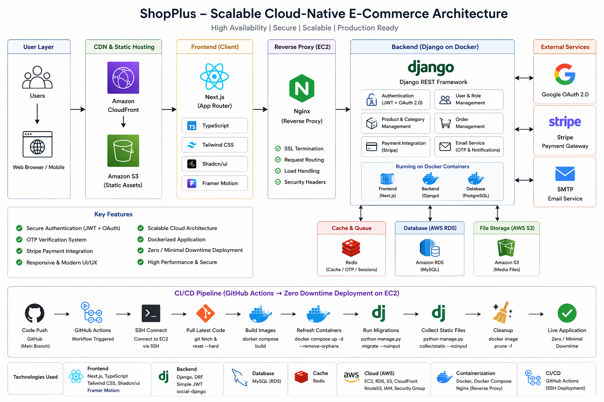
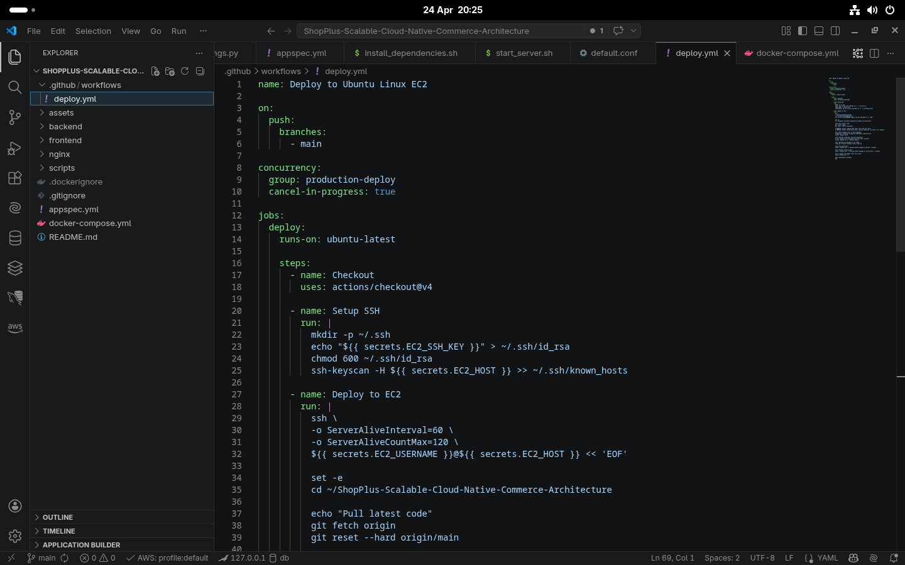
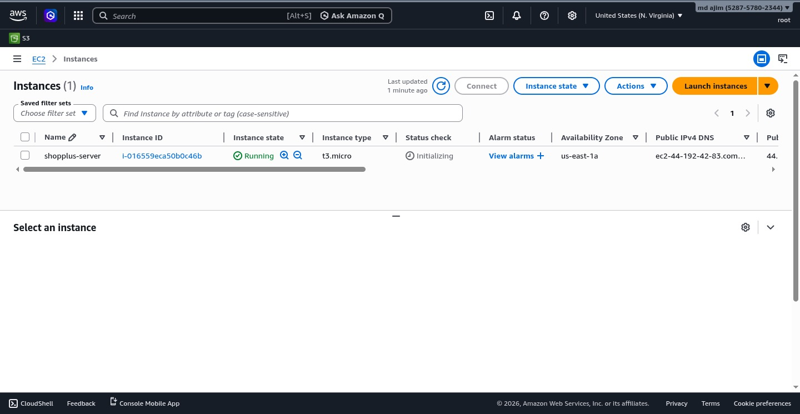
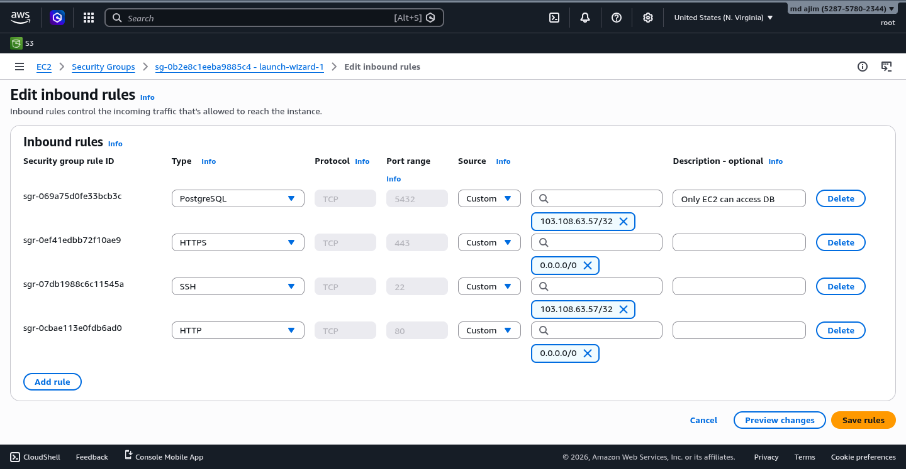
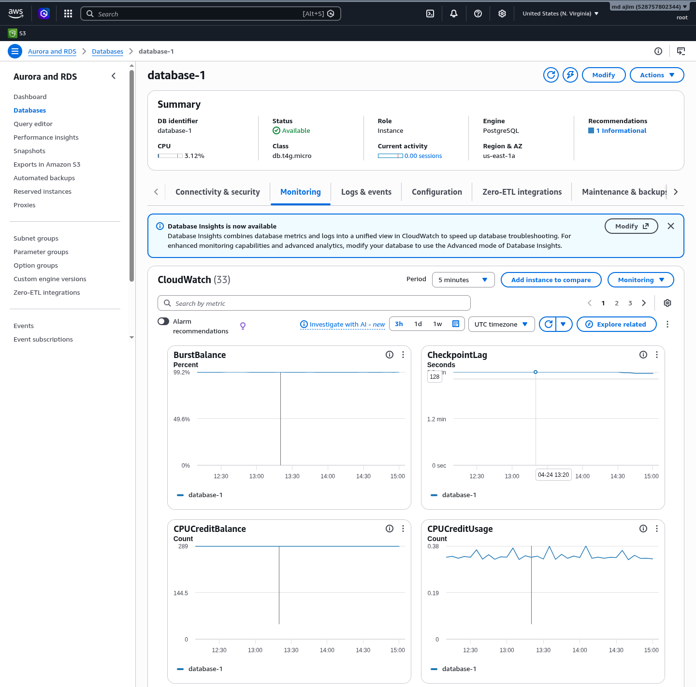
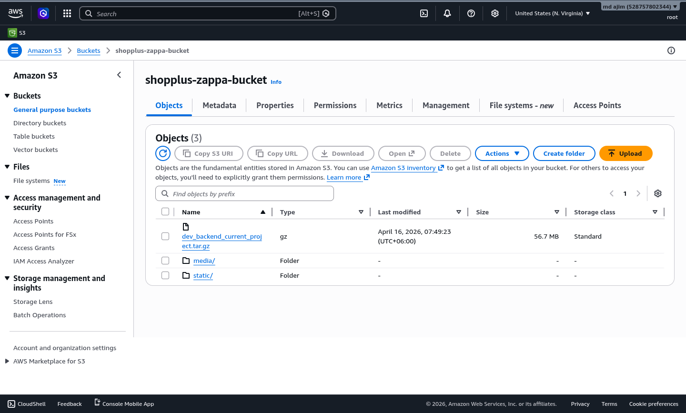
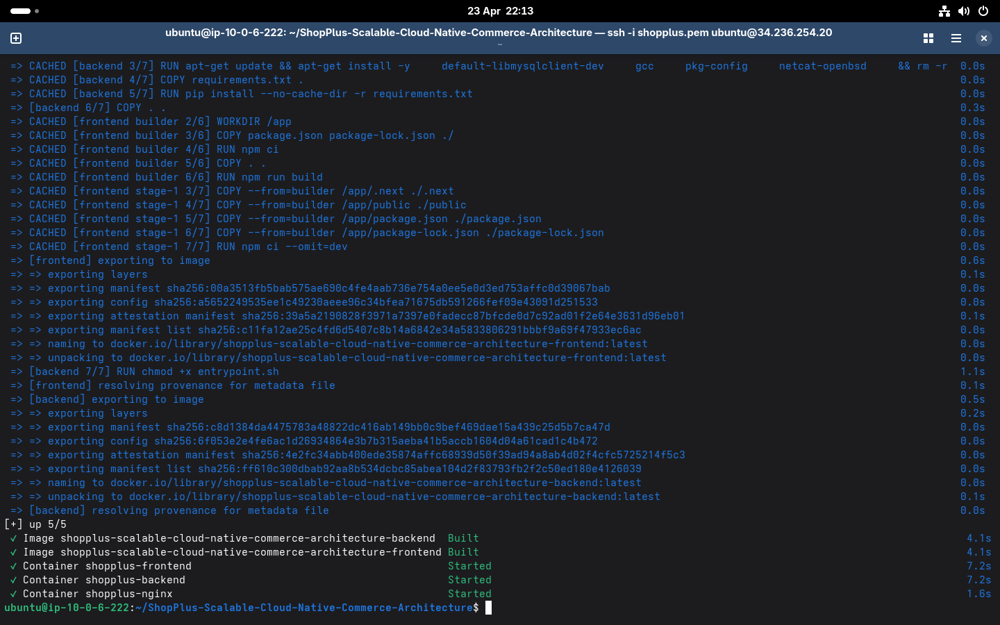
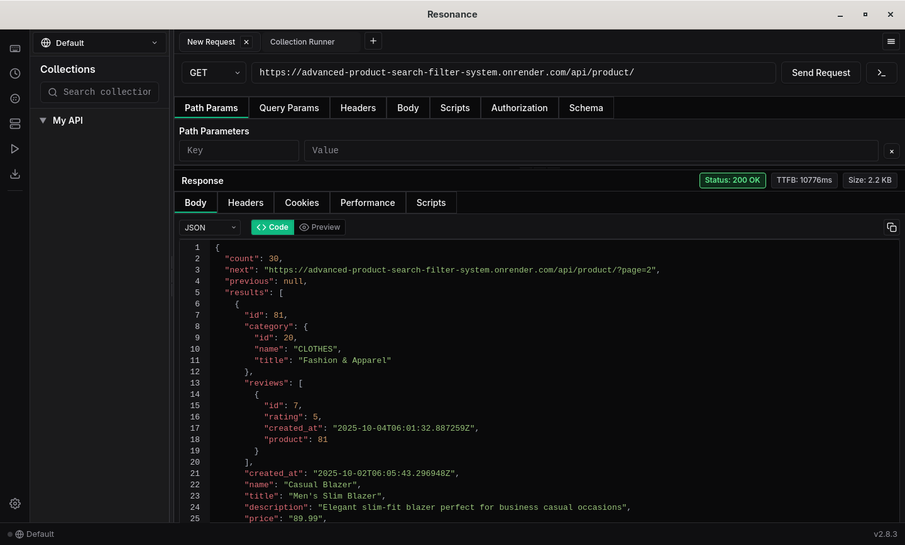

# 🛒 ShopPlus – Scalable Cloud-Native E-Commerce Platform

ShopPlus is a **production-ready, scalable, cloud-native e-commerce platform** built with modern full-stack and DevOps best practices. It demonstrates how to design, containerise, and deploy a **secure, high-performance, enterprise-grade system** on cloud infrastructure.

---

## 🌐 Live Overview

* 🚀 **Architecture:** Cloud-native, containerised, scalable
* 🔐 **Authentication:** JWT + Google OAuth 2.0
* ☁️ **Deployment:** AWS EC2 (Dockerised)
* ⚡ **Performance:** CDN + caching + optimised queries

---

## 🏗️ Architecture Diagram



---

## 🧠 Architecture Overview

* **Frontend Layer:** Next.js served via CDN (CloudFront) for fast global delivery
* **Reverse Proxy:** Nginx for SSL termination, routing, and security headers
* **Backend Layer:** Django REST API with JWT + OAuth authentication
* **Cache Layer:** Redis for OTP, sessions, and performance
* **Database:** AWS RDS (MySQL) for managed, reliable storage
* **Storage:** S3 for media/static assets
* **DevOps:** Dockerised services with CI/CD (GitHub Actions) deployed to EC2

---

## 🌟 Key Features

### 🔐 Authentication & Security

* JWT-based authentication
* Google OAuth 2.0 login
* OTP email verification system
* Secure session handling

### 🛍️ E-Commerce Core

* Product & category management
* Order management system
* User & role management

### 💳 Payment Integration

* Integrated Stripe for secure payment processing
* Supports checkout flow with order confirmation
* Uses Stripe test mode for safe transaction simulation
* Backend validates payment and updates order status securely

### ⚡ Performance Optimisation

* Redis caching (OTP & sessions)
* Optimised DB queries
* CDN-based asset delivery

### 🎨 Modern UI/UX

* Responsive design
* Smooth animations (Framer Motion)
* Accessible components (Shadcn UI)

---

## 🛠️ Tech Stack

### Frontend

* Next.js (App Router)
* TypeScript
* Tailwind CSS
* Shadcn UI
* Framer Motion

### Backend

* Python, Django
* Django REST Framework (DRF)
* Simple JWT
* social-auth (Google OAuth)

### Database & Cache

* MySQL (AWS RDS)
* Redis

### Cloud & DevOps

* AWS EC2 (Ubuntu)
* AWS S3 (media)
* AWS CloudFront (CDN)
* Docker & Docker Compose
* Nginx (reverse proxy)
* GitHub Actions (CI/CD via SSH)

---

## ⚙️ CI/CD Pipeline (Zero / Minimal Downtime)

**Strategy:** Build images on server → replace containers with minimal downtime → run migrations → collect static → cleanup.

### 🔄 Workflow Steps

1. Push to `main` branch
2. GitHub Actions workflow triggers
3. Secure SSH connection to EC2
4. Pull latest code (`git fetch` + `reset --hard`)
5. Build Docker images (`docker compose build`)
6. Refresh containers (`docker compose up -d --remove-orphans`)
7. Run migrations (`manage.py migrate`)
8. Collect static files (`collectstatic`)
9. Cleanup unused images (`docker image prune -f`)

> Add CI/CD screenshot below



---

## 🐳 Deployment Architecture

* Services run inside Docker containers
* Nginx handles SSL, routing, and security
* Backend, DB, cache are isolated for scalability
* Minimal downtime deployments via container refresh

---

## 🚀 Installation & Setup

### Prerequisites

* Docker
* Docker Compose

### 1️⃣ Clone Repository

```bash
git clone https://github.com/md-ajim/ShopPlus-Scalable-Cloud-Native-Commerce-Architecture.git
cd ShopPlus-Scalable-Cloud-Native-Commerce-Architecture
```

### 2️⃣ Environment Setup

Create `.env` files in:

* `/backend`
* `/frontend`

Use `.env.example` as reference.

### 3️⃣ Run Project

```bash
docker-compose up --build
```

### 4️⃣ Access Application

* Frontend: [http://localhost:3000](http://localhost:3000)
* API: [http://localhost:8000/api/](http://localhost:8000/api/)

---

## 📸 Deployment & Infrastructure Proof

> Add real screenshots to prove production deployment

### ☁️ AWS EC2 Instance



### 🔐 Security Group (Ports 80/443)



### 🗄️ AWS RDS Database



### 🪣 S3 Storage



### 🐳 Docker Containers



### 🌐 Live Application


### 🔗 API Response (Postman / Browser)



---

## 📂 Project Structure (Simplified)

```bash
frontend/        # Next.js app
backend/         # Django API
nginx/           # Nginx config
compose.yml      # Docker services
```

---

## 📈 Project Highlights

* Designed **scalable cloud-native architecture**
* Implemented **secure authentication system**
* Built **containerised production environment**
* Deployed with **CI/CD automation**
* Achieved **minimal downtime deployment**

---

## 👨‍💻 Author

**MD AJIM** Full-Stack Developer

* 💼 Experience: 2+ Years Professional | 5+ Years Coding
* 🌐 Portfolio: [https://md-ajim.vercel.app/](https://md-ajim.vercel.app/)
* 💻 GitHub: [https://github.com/md-ajim](https://github.com/md-ajim)
* 🔗 LinkedIn: [https://www.linkedin.com/in/md-ajim/](https://www.linkedin.com/in/md-ajim/)

---

## 📌 Final Note

This project demonstrates:

* Real-world system design
* DevOps & cloud deployment skills
* Production-level architecture thinking

---

⭐ If you find this project helpful, consider giving it a star!
